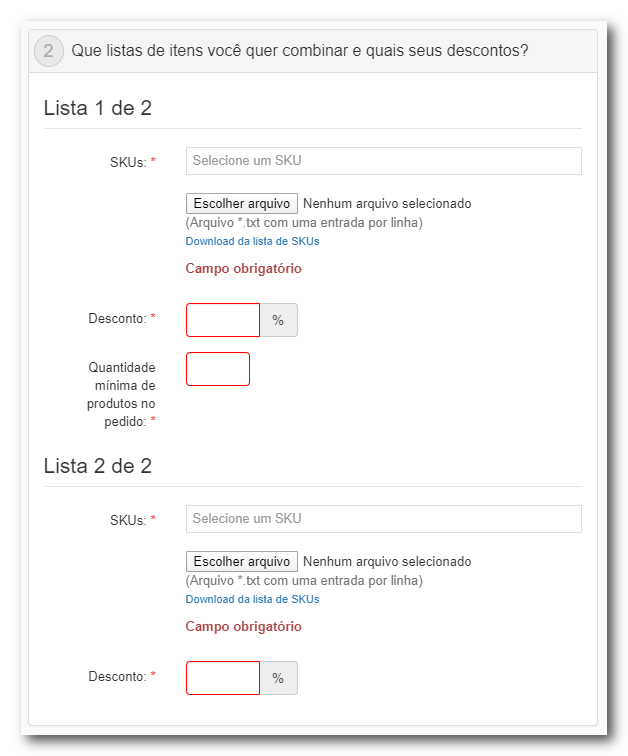

# Compre Junto

Essa promoção é usada para aplicar o desconto a dois ou mais produtos quando ambos são adicionados ao carrinho, os produtos devem ser cadastrados em duas listas de SKUs, podendo então definir um valor de desconto para cada uma delas.

A primeira lista deve conter os produtos que deverão estar presente em quantidade mínima no carrinho para que ao adicionar os produtos da segunda lista o desconto seja aplicado.

Ao contrário da Promoção Regular essa modalidade de promoção não aceita configuração no tipo de desconto, sendo concedido apenas desconto percentual.

## Listagem dos Produtos

Ambas as listas serão cadastradas de forma parecida, a única diferença entre elas será a configuração de quantidade mínima definida para os produtos da Lista 1. Os campos necessários para o cadastro serão:

- **SKUs**: *Listagem de SKUs afetados pela promoção*
- **Desconto**: *Valor percentual do desconto que será aplicado aos itens. Esse valor é aplicado em cada uma das listas de forma individual*
- **Quantidade Mínima**: *Quantidade mínima de SKUs a serem incluídos no carrinho para garantir o direito ao desconto. Esse campo só deve ser aplicado à lista 1* 

## Campos Obrigatórios

Os campos obrigatórios seguem o mesmo padrão usado na [Promoção Regular](Regular_Promotion.md).

## Restrições e limitações de uso

- **Quantas vezes a promoção poderá ser usada**: *Quando não selecionado o campo **ilimitado** um campo é disponibilizado para definir o limite de aplicações para a promoção. Uma vez criada a promoção está condição somente deverá ser aplicada aos pedidos realizados a partir da data de criação dessa configuração, não devendo afetar os pedidos feitos anteriormente*
-  **Quantas vezes a promoção poderá ser usada por cliente**: *Define a restrição de utilização da promoção por cliente, não relacionada à restrição global. Caso seja definido um limite geral para a loja este limite deve ser priorizado em relação ao limite por cliente*
- **Permitir promoções cumulativas**: *Permite a aplicação de mais de uma promoção com o mesmo tipo de desconto serem aplicadas simultaneamente*
-  **Permitir que a promoção seja cumulativa com preços manuais**: *Define a possibilidade de acumular os benefícios da promoção em itens cujos preços tenham sido alterados manualmente por um operador de call-center*

## Definindo as Regras de Aplicabilidade

O seller poderá escolher dentro do conjunto de critérios as condições que os clientes deverão atender para terem direito aos benefícios da promoção, que serão:

**Valor mínimo ou máximo do pedido**: *Considera o valor do carrinho, sem considerar descontos ou valor de frete*
**Validação por número do cartão**: *O desconto será aplicado apenas para os clientes que pagarem com cartões das bandeiras definidas*
**Grupo de clientes**: *O desconto será aplicado caso o cliente esteja dentro do grupo de clientes criado pelo seller, é importante que o nome adicionado ao grupo seja exatamente igual ao nome no pedido para que a configuração funcione corretamente*
**UTM Source**: *O desconto será aplicado caso a origem da UTM do cliente esteja dentro das origens definidas*

## Apoio Visual



## Exemplo de json de envio

```ad-example
title: Create new Buy Together Promotion
Uma loja de produtos de informática decide fazer uma promoção de 15% de desconto em todos os produtos da linha "gaming" durante o final de semana:
~~~json
{
	"name": "Gaming Weekend",
	"isActive": true,
	"description": "15% de desconto em toda linha gamer!",
	"beginDateUtc": "2022-10-28 00:00:01",
	"endDateUtc": "2022-10-30 23:59:59",
	"discountType": "percentual",
    "type": "regular"
	"maximumUnitPriceDiscountnumber": 100,00,
    "maxNumberOfAffectedItems": 5,
    "idSeller": "1",
    "marketingTags": {"gamer", "jogos", "gaming"},
    "paymentsMethods": {creditCard, pix, billing},
    "categories": {"jogos", "acessorios gamer","computador gamer", "notebook gamer"},
    "categoriesAreInclusive": true,
    "totalValueFloor": 300,00,
    "totalValueCeling": 10000,00,
    "isMinMaxInstallments": true,
    "minInstallment": 1,
    "maxInstallment": 5,
    "maxUsage": 2000,
    "maxUsagePerClient": 3,
    "multipleUsePerClient": true
}
~~~
```