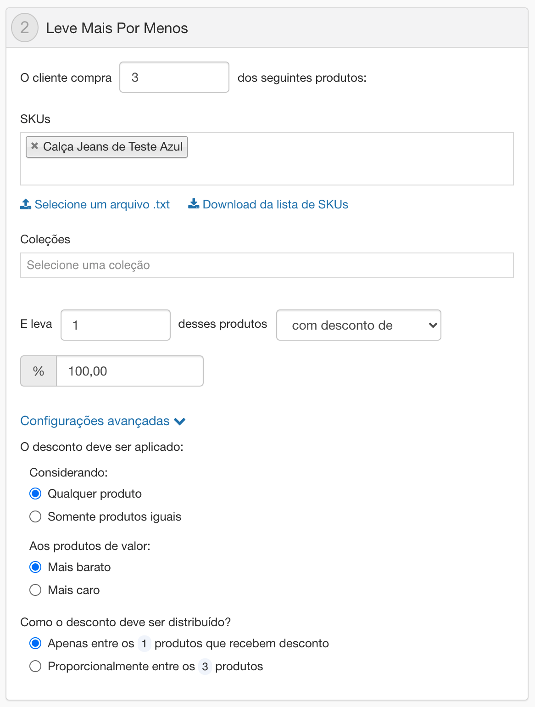

# Mais por Menos

Essa promoção é usada para conceder desconto quando o cliente adiciona várias unidades do mesmo produto ao carrinho. Nas configurações da promoção o seller deve definir em quais coleções ou SKUs o ela será aplicada, além de definir a quantidade mínima de itens adicionados ao carrinho para que seja válida e o número de itens nos quais serão aplicados o desconto.

## Campos Obrigatórios

Os campos obrigatórios seguem o mesmo padrão usado na [Promoção Regular](Regular_Promotion.md).

## Configurações Gerais

Definindo os produtos, quantidade mínima e o tipo de desconto aplicados à promoção:

- **Quantidade Mínima**: *Quantidade mínima de unidades do mesmo produto a serem incluídos no carrinho para garantir o direito ao desconto.
   - **SKUs**: *Lista de SKUs que serão incluídos na promoção*
   - **Coleções**: *Lista de coleções que serão incluídas na promoção*

## Restrições e limitações de uso

Conjunto de regras que determinam a aplicabilidade da promoção dentro da loja

- **Quantas vezes a promoção poderá ser usada**: *Quando não selecionado o campo **ilimitado** um campo é disponibilizado para definir o limite de aplicações para a promoção. Uma vez criada a promoção está condição somente deverá ser aplicada aos pedidos realizados a partir da data de criação dessa configuração, não devendo afetar os pedidos feitos anteriormente*
-  **Quantas vezes a promoção poderá ser usada por cliente**: *Define a restrição de utilização da promoção por cliente, não relacionada à restrição global. Caso seja definido um limite geral para a loja este limite deve ser priorizado em relação ao limite por cliente*
- **Permitir promoções cumulativas**: *Permite a aplicação de mais de uma promoção com o mesmo tipo de desconto serem aplicadas simultaneamente*
-  **Permitir que a promoção seja cumulativa com preços manuais**: *Define a possibilidade de acumular os benefícios da promoção em itens cujos preços tenham sido alterados manualmente por um operador de call-center*

## Apoio Visual

