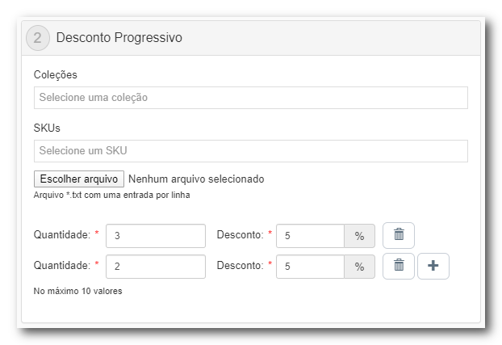

# Desconto Progressivo

Essa promoção é usada para conceder desconto com valor variável de acordo com a quantidade de produtos inseridos no carrinho. Os itens podem ser adicionados por lista de SKUs ou Coleções.

Assim como a Promoção Compre Junto, essa modalidade de promoção não aceita configuração no tipo de desconto, sendo concedido apenas desconto percentual.

## Campos Obrigatórios

Os campos obrigatórios seguem o mesmo padrão usado na [Promoção Regular](Regular_Promotion.md).

## Restrições e limitações de uso

Conjunto de regras que determinam a aplicabilidade da promoção dentro da loja

-  **Permitir que a promoção seja cumulativa com preços manuais**: *Define a possibilidade de acumular os benefícios da promoção em itens cujos preços tenham sido alterados manualmente por um operador de call-center*
- **Somente para itens iguais**: *O desconto será aplicado por SKU, caso essa opção seja marcada a quantidade de itens será validada individualmente por SKU, caso não seja marcada será considerado o somatório das unidades desses produtos*

## Apoio Visual

